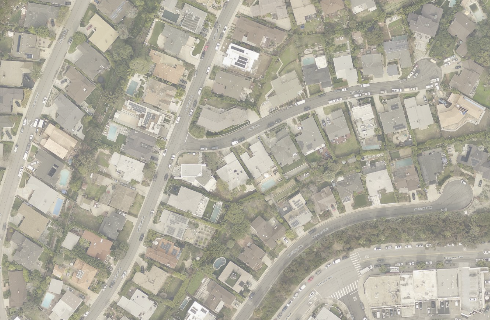
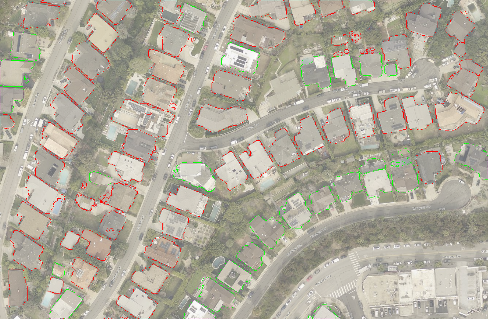

# Palisades Fire Analysis Report

## Before and After Images

### Before Image

### After Image

### Compared Image

## Analysis Results

The following analysis was generated by the LLM:

**Summary:**

- Homes that survived had better defensible space, fire-resistant materials, and were located downwind or on flat terrain.
- Burned homes had flammable materials, were closely spaced, and were uphill where fire spreads faster.
- Rebuilding should focus on fire-resistant materials, increased spacing, and vegetation management to mitigate future risks.

**Conclusions:**

Based on the provided images and historical fire data, homes outlined in green likely survived due to three main factors. First, these homes appear to have more defensible space around them, reducing the chance of fire spreading from nearby vegetation or structures. Second, the surviving homes may be constructed with more fire-resistant materials such as concrete, brick, or metal roofs, which are less likely to ignite. Third, these homes are often located in areas that are either downwind or on flatter terrain, which naturally slows fire progression.

The homes outlined in red burned primarily for three reasons. First, these homes seem to be closer together, allowing the fire to jump easily from one structure to another. Second, many of these homes likely had more flammable materials, such as wooden roofs or siding, which are more susceptible to catching fire. Third, the positioning of these homes on uphill slopes contributed to their destruction, as fires tend to move faster uphill due to preheating of fuels and rising heat.

**Confidence Level:** 8

**Recommendations:**

To avoid similar outcomes in future fires, the neighborhood should be rebuilt with fire-resistant materials such as brick, concrete, and metal roofing. Increasing the spacing between homes and maintaining well-managed, fire-resistant vegetation around properties can also significantly reduce fire risk. Implementing these measures would likely lower the probability of similar widespread destruction, as they address the primary factors that contributed to the fire's spread in this incident. Using insights from the Tubbs Fire, Camp Fire, and Hawaii Wildfires, communities that adopt these strategies see a marked improvement in fire survivability.

---
_End of Report_