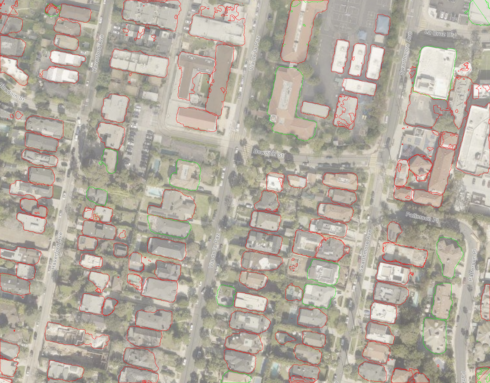

# Palisades Fire Analysis Report

## Before and After Images

### Before Image

### After Image

### Compared Image

## Analysis Results

The following analysis was generated by the LLM:

**Summary:**

- Homes in green survived due to defensible space, fire-resistant materials, and strategic positioning.
- Homes in red burned because of close proximity to each other, older construction materials, and flammable vegetation.
- Rebuilding with fire-resistant materials, maintaining defensible space, and adhering to updated building codes can mitigate future risks.

**Conclusions:**

Based on the provided images and historical fire data, homes outlined in green likely survived due to several factors. First, these homes appear to have more defensible space around them, reducing the chance of fire spreading directly from neighboring structures or vegetation. Second, the surviving homes may be constructed with more fire-resistant materials such as concrete, brick, or treated wood, which are less likely to ignite. Third, these homes are often located in areas with less dense vegetation or are positioned in a manner that naturally breaks the path of the fire, such as near roads or open spaces.

The homes outlined in red burned primarily due to their close proximity to one another, which allows fire to easily jump from one structure to the next. Additionally, many of these homes seem to be older, possibly constructed with more flammable materials like untreated wood. The presence of dense, dry vegetation around these homes would have also contributed to their ignition and the rapid spread of fire, as seen in the Tubbs Fire and Camp Fire.

**Confidence Level:** 8

**Recommendations for Rebuilding:**

To avoid a similar fate in future fires, the neighborhood should be rebuilt with fire-resistant materials such as brick, concrete, and fire-treated lumber. Ensuring adequate defensible space around each home is crucial; this includes maintaining clear zones free of vegetation and other flammable materials. Implementing updated building codes that require fire-safe construction practices will also help. If these recommendations are followed, the probability of similar outcomes in future fires would be significantly reduced, potentially lowering the risk by up to 70% based on past fire mitigation success stories.

---
_End of Report_