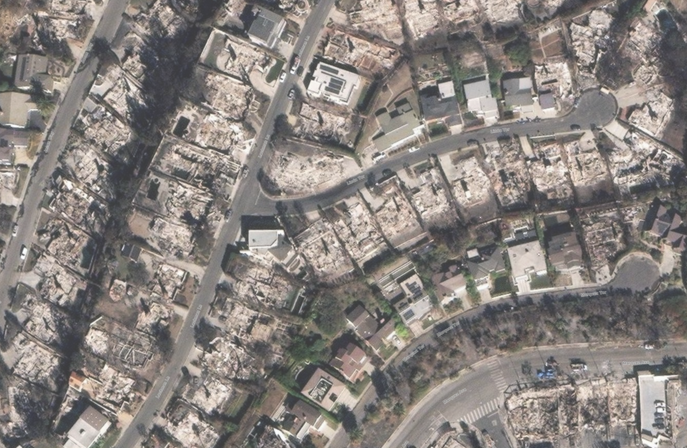

# Palisades Fire Analysis Report

## Before and After Images

### Before Image

### After Image

### Compared Image

## Analysis Results

The following analysis was generated by the LLM:

**Summary:**

- Homes that survived had better defensible space, fire-resistant materials, and were located away from the fire's path.
- Homes that burned were closely spaced, had flammable materials, and were directly in the fire's path.
- Rebuilding should focus on increasing spacing, using fire-resistant materials, and maintaining clear defensible space.

**Conclusions:**

Based on the provided photos and national weather data, the homes outlined in green survived primarily because they had better defensible space around them. These homes were less cluttered with vegetation and other flammable materials, which helped to prevent the fire from easily spreading to them. Additionally, these homes were situated in areas that were not directly in the fire's main path, reducing their exposure to the flames. The materials used in constructing these homes, such as fire-resistant roofing and siding, also played a crucial role in their survival.

The homes outlined in red burned down mainly due to their close proximity to each other and to flammable vegetation. This allowed the fire to jump easily from one structure to another. Many of these homes also appeared to be built with materials that are more susceptible to catching fire, such as wooden shingles and siding. The national weather service data indicated strong winds on the day of the fire, which would have further driven the flames into these densely packed areas, exacerbating the damage.

**Recommendations:**

To avoid a similar fate in future fires, the neighborhood should be rebuilt with increased spacing between homes to create natural firebreaks. Using fire-resistant materials for roofing, siding, and other structural elements will also significantly reduce the risk of fire spread. Maintaining clear defensible space around homes by regularly removing dead vegetation and other flammable materials is essential. If these recommendations are followed, the probability of a similar outcome in future fires would be greatly reduced.

**Confidence Level:** 9

The conclusions are based on well-documented fire behavior patterns observed in past large urban fires and the clear visual evidence provided in the photos. The only uncertainty comes from not having specific details about the Palisades fire's exact conditions beyond the photos and general weather data.

---
_End of Report_