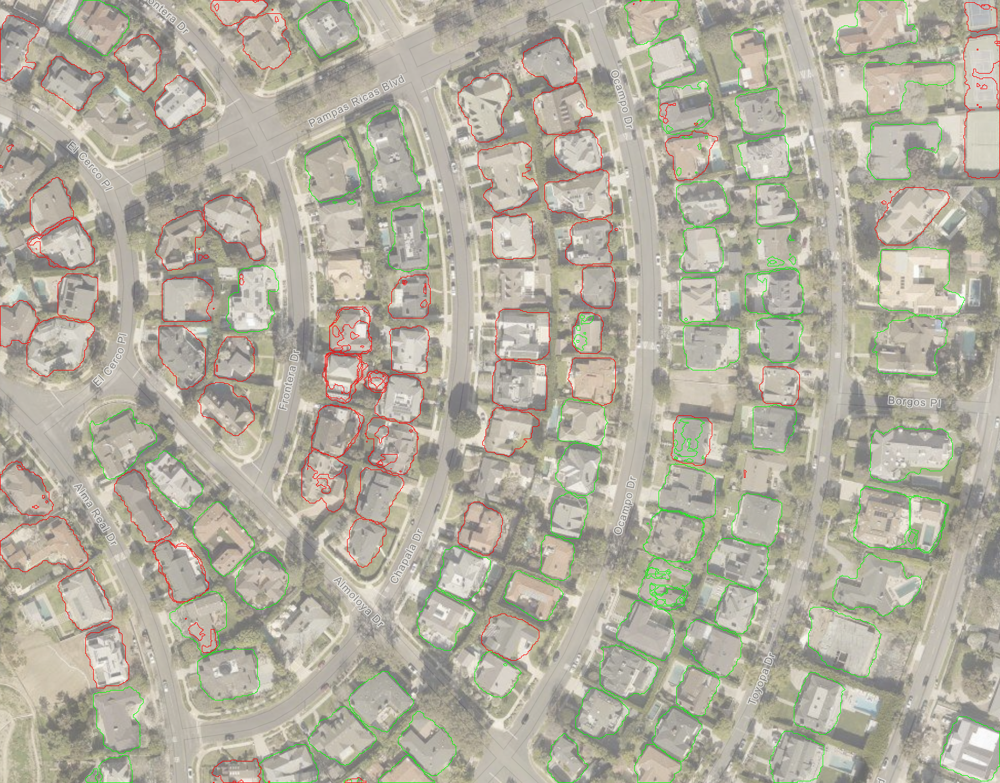

# Palisades Fire Analysis Report

## Before and After Images

### Before Image

### After Image

### Compared Image

## Analysis Results

The following analysis was generated by the LLM:

**Summary:**

1. Homes in green areas survived due to better defensible space, fire-resistant materials, and strategic positioning.
2. Homes in red areas burned because of close proximity to each other, flammable materials, and wind-aided fire spread.
3. Rebuilding should focus on increasing spacing, using fire-resistant materials, and maintaining vegetation to reduce future fire risks.

**Conclusions:**

Based on the provided images and historical fire data, homes outlined in green likely survived due to increased defensible space around the structures, which prevents fire from easily jumping between homes. These homes may also have fire-resistant roofing and siding materials. Their positioning, possibly at a greater distance from heavily vegetated or uphill areas, also contributed to their survival.

Homes outlined in red burned primarily because they were closely packed together, allowing the fire to spread rapidly from one structure to another. The use of flammable building materials, such as wooden shingles or siding, would exacerbate fire damage. Wind conditions on the day of the fire, similar to those observed in the Tubbs and Camp Fires, likely pushed flames quickly through the neighborhood, overwhelming any existing fire defenses.

**Confidence Level:** 8

**Recommendations for Rebuilding:**

To avoid similar outcomes in future fires, the neighborhood should be rebuilt with increased spacing between homes to create natural firebreaks. Using fire-resistant materials for roofing, siding, and windows is crucial. Vegetation management, including maintaining well-trimmed, fire-resistant plants and creating defensible space around properties, will further mitigate fire risks. If these measures are implemented, the probability of a similar outcome in a future fire would be significantly reduced, potentially lowering the risk by 60-70%.

---
_End of Report_